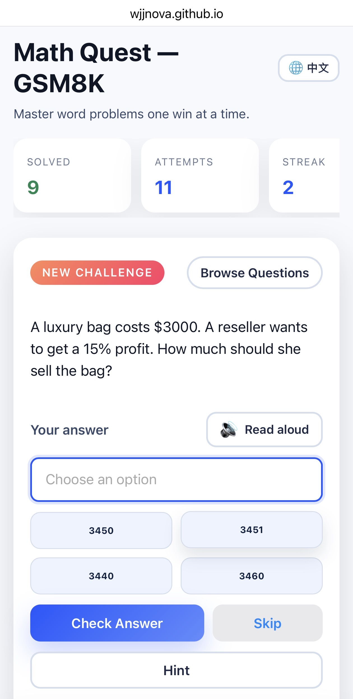
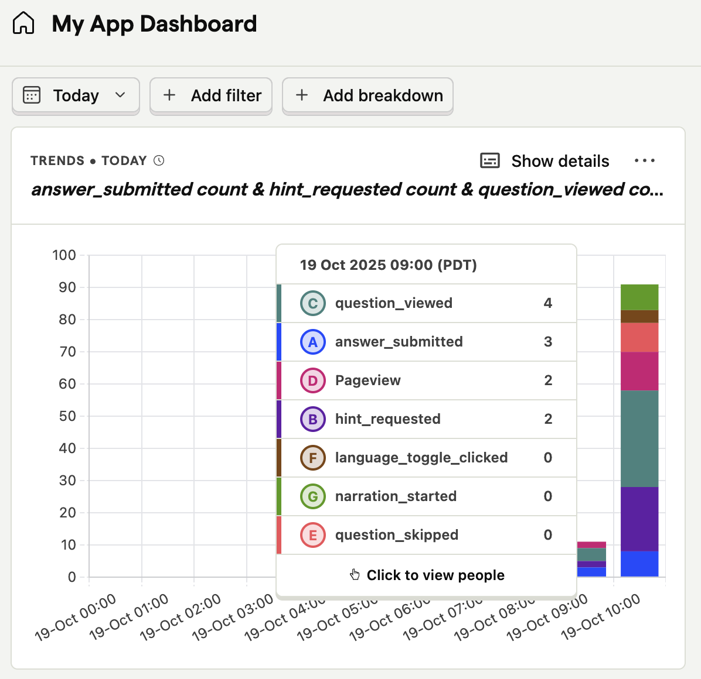

# Math Quest

A playful GSM8K practice coach that runs entirely in the browser—no installs, no backend. Drill through adaptive word problems, celebrate streaks with confetti and a giant hamster, and inspect telemetry to see how learners are progressing.

**▶️ [Launch the live demo](https://wjjnova.github.io/math-practice-app/src/client/index.html)**

<p align="center">
  
</p>

## Why it sticks

- **Adaptive flow** keeps mixing new problems with the ones you still need to master.
- **Fast interactions** let you tap auto-generated multiple-choice options or type answers directly.
- **Celebratory feedback** (confetti, sound, hamster) rewards streaks of four or more correct answers.
- **Offline-ready dataset** ships as a static JavaScript module—perfect for GitHub Pages hosting.
- **Built-in telemetry** (PostHog) tracks key actions so you can spot trends and highlight wins.

<p align="center">
  
</p>

## Quick Start

1. Start the bundled dev server (serves the static site and prepares the GSM8K dataset module if needed). The repository includes a convenience script:
  ```bash
  # preferred: start the app and open your browser
  ./start.sh 3000

  # or run the server directly
  python3 src/server/serve.py --port 3000
  ```
2. If you used `./start.sh`, your browser should open automatically to `http://localhost:3000`.
3. Use the "Browse Questions" panel to pick any problem, or stay in practice mode for the adaptive flow.

> The first run may take a moment while the dataset is downloaded and written to `src/client/data/questions_gsm8k.js`.

Your progress (attempts, streaks, and which questions still need review) saves automatically in the browser. Clear `localStorage` for a fresh start.

## Repo Layout

```
src/
  client/
    index.html        # Main entry point
    styles.css        # UI styling
    app.js            # Core application logic
    data/
      questions_gsm8k.js    # Pre-built GSM8K dataset exported as an ES module
  server/serve.py     # Local development server that also bootstraps the dataset file
```

## Preparing for Static Hosting (GitHub Pages)

The browser expects `data/questions_gsm8k.js` relative to `index.html`, which maps to `src/client/data/questions_gsm8k.js` in the repository. If the file is missing or outdated, run the dev server once and it will download and regenerate the dataset automatically:

```bash
python3 src/server/serve.py --port 3000
```

After the first run, stop the server, commit the updated `src/client/data/questions_gsm8k.js`, push to GitHub, and enable Pages (branch: `main`, folder: `/root`). GitHub Pages will serve both `index.html` and `data/questions_gsm8k.js`, so no backend is required.

## Updating the Dataset

If a newer GSM8K dump becomes available, either delete `src/client/data/questions_gsm8k.js` and rerun the dev server to rebuild it, or update the source URL inside `serve.py` and run:

```bash
python3 src/server/serve.py --port 3000
```

Once the file regenerates, stop the server and commit the refreshed module.

> ⚠️ The app never fetches GSM8K automatically at runtime. Make sure to commit the refreshed `src/client/data/questions_gsm8k.js` so static hosting stays in sync.

## Next Ideas

- Add gentle hints or worked solutions after multiple incorrect tries.
- Group questions by topic or difficulty to create custom practice tracks.
- Expose a parent dashboard summarizing session stats across devices.
